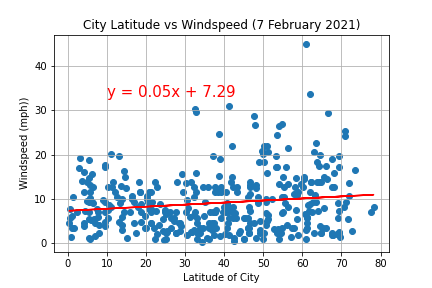
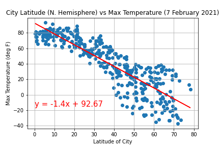
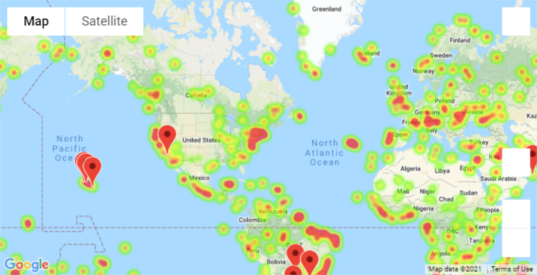

# python-api-challenge

## Observations related to Weather and Ideal Weather Conditions

* Day-to-Day weather patterns (windspeed) are poorly correlated to latitude
    * With a correlation  slope of 0.05 and an r-value of 0.144
    * Weather patterns are dependent on wind currents/jet streams/seasonality which can be hard to capture with a single snapshot of a particular point in time

* Unlike windspeed, temperatures are significantly correlated to latitude
    * With a correlation slope of -1.4 and an r-value of -0.865
    * This makes sense because the farther a person gets away from the equator, the greater the distance they are from the sun
    * This also tracks personal experience with living in a northern climate. 

* Eight out of ten "ideal" vacation locations are +/- 10 degrees off of the Tropic of Cancer/Tropic of Capricorn which are 23.4 degrees and -23.4 degrees, respectively.  The areas semi-close to the equator are the most temperate.
    * This makes sense; as stated above, more temperate weather is typically found around/closer to the equator.

|City          |Latitude  | Delta of Tropic | Longitude | Country | Hotel Name                                   |
| ------------ | -------: | :-------------: | --------: | :-----: | -------------------------------------------- |
|manutuke      | -38.6833 | 15.2833         |177.9167   | NZ      | Jolly Stockman Hotel                         |
|la palma      | 33.8464  | 10.4464         |-118.0467  | US      | La Quinta Inn & Suites by Wyndham Buena Park |
|tacuarembo    | -31.7333 | 8.3333          |-55.9833   | UY      | Hotel Orange                                 |
|chai badan    | 15.2000  | 8.2000          |101.1333   | TH      | Narai Grand Hotel                            |
|hilo          | 19.7297  | 3.6703          |-155.0900  | US      | Hilo Hawaiian Hotel                          |
|makakilo city | 21.3469  | 2.0531          |-158.0858  | Us      | Marriott's Ko Olina Beach Club               |
|gwadar        | 25.1216  | 1.7216          |62.3254    | PK      | Sadaf Resort                                 |
|cananeia      | -25.0147 | 1.6147          |-47.9267   | BR      | Casa azul                                    |
|kapaa         | 22.0752  | 1.3248          |-159.3190  | US      | Sheraton Kauai Resort at Coconut Beach       |
|dourados      | -22.2211 | 1.1789          |-54.8056   | BR      | Bravo City Hotel                             |

##### https://github.com/adam-p/markdown-here/wiki/Markdown-Cheatsheet (accessed 11 February 2021)
